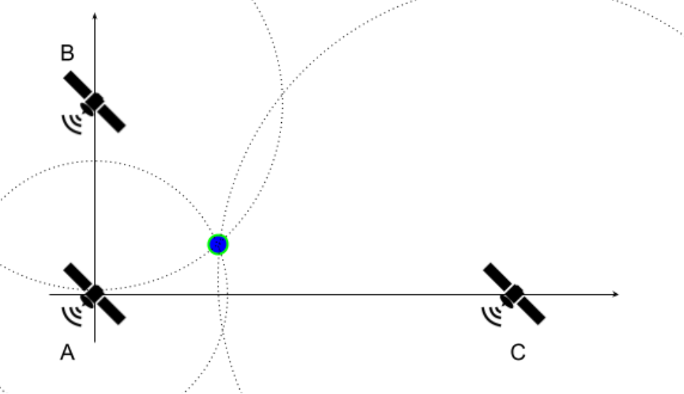

## GPS

### Instructions

In this activity, you must write a program in RISC-V assembly language that computes your geographical coordinates in a bidimensional plane, based on the current time and messages received from 3 satellites.

Figure 6.2.1: Satellites' Positions on the Plane

To simplify the exercise, it is assumed that satellite A is placed at the origin of the cartesian plane (0, 0), while B and C are positioned at (0, YB) and (XC, 0), respectively. The satellites continuously send messages with a timestamp via waves that propagate in all directions at a speed of 3 x 108 m/s. At a given time TR, you receive a message from each satellite containing the timestamps TA, TB and TC. Assuming that all clocks are perfectly synchronized, print your coordinates (x, y) in the cartesian plane. Note that the formulation used in this exercise is not realistic.

### Input

- **Line 1** - Coordinates YB and Xc. Values are in meters, represented by 4-digit integers in decimal base and preceded by a sign ('+' or '-').
- **Line 2** - Times TA, TB, Tc and TR. Values are in nanoseconds, represented by 4-digit integers in decimal base

### Output

- **Your coordinate** - (x, y). Values are in meters, approximated, represented by 4-digit integers in decimal base and preceded by a sign ('+' or '-').

### Examples

| Test Case | Input                               |   Output    |
| :-------- | :---------------------------------- | :---------: |
| 1         | +0700 -0100 2000 0000 2240 2300 | -0088 +0016 |
| 2         | +1042 -2042 6823 4756 6047 9913 | -0902 -0215 |
| 3         | -2168 +0280 3207 5791 3638 9550 | +0989 -1626 |
| 4         | -2491 +0965 2884 7511 2033 9357 | -0065 -1941 |
| 5         | -0656 +1337 0162 2023 1192 9133 | +1255 -2381 |

### Notes and Tips

- Multiple values written or read on/from the same line will be separated by a single space.
- Each line ends with a newline character '\n'.
- For this exercise, approximate solutions are accepted.
  - Solutions with an absolute error smaller than 10 will be considered correct.
- **The usage of the same method used in [Exercise 6.1](ch06-01-square-root.md) with more iterations (e.g. 21 iterations) is recommended**. Other methods to square root approximation can be used, as long as:
  - It used only integers. Floating point numbers or the RISC-V square root instruction cannot be used.
  - The approximation is as or more precise than the suggested method.
- It is best to work with distances in meters and time in nanoseconds, so that the provided input values do not cause overflow when using the proposed method and a good precision might be achieved.
- Problem Geometry:
  - There are many ways to solve this exercise. Here, we propose an approach that uses the equation of a circle. Given that dA, dB and dC are the distances between your position and the satellites A, B and C, respectively:
    - x2 + y2 = dA2 (Eq. 1)
    - x2 + (y - YB)2 = dB2 (Eq. 2)
    - (x - XC)2 + y2 = dC2 (Eq. 3)
  - Using Equations 1 and 2:
    - y = (dA2 + YB2 - dB2) / 2YB (Eq. 4)
    - x = + sqrt(dA2 - y2) OR - sqrt(dA2 - y2) (Eq. 5)
  - To find the correct x, you can try both possible values in Equation 3 and check which one is closer to satisfying the equation.
- You can test your code using the simulator's assistant from this <a href="https://riscv-programming.org/ale/#select_url_content=TjRJZ3RnaGdsZ2RnK2dCd2djd0tZZ0Z3aEFHaEJBWndLZ0lCY0laUzRDQmpBSnlnVk14Q2pBUUhzN1NBQ1lIZ0tvQkpPQUFsVUFHd1NvNk9IZ0VFaUpjcFRnQmxlbzE0QmZIZ0RNNkhNRHdBNklBSFFCNk1Cd0FtQVZ3bW9DbHdzVElWUzVnRllFekFiaE1ZTms1dVBnQVpEaG9JQ1FBbFZGRFNYUU1qVXd0ck8wZG5TeG9PR0JoVUdsSW9QSjgtRUVDWUlKb0pOeDRBVVFBUEFEWTRBQ1llVkViU1ZCaGJBZ1VsRDFVTkJpWStJSjRlWEpneU9uc2lyZ0FLQUVvSm1DbXBnbnRwT2xYS3paNVNBQXNTYzNzb0hnQmVIZ0tBZDBFUmNTa1pKYk1tbVJvU1ZCNW04emFNRHdBT0lBQlRVWmhXQjAyVGw0ZEFTWEY0TjN1UEVpMFRpOE80KzBtbXhPWnhtQlNLSlZtNWdROWdJeHlXY01Ta0tDMkttdUlJNXlnNWdndGxzY0I2WkRlRzBPYVFBd2tZRUZCYXNVOG1ZY0hUTm5CcmdBK2RhOHpaVWhIbU9FZVRFMG5rS3VHa2V4MERZTTh4b0FvTUdod1hMc1lXb0RuT1VpckxHYXphNk9TU3FiOFBUUUNSd1ZBUU9nU0FDZWdOSTh4KzJrbEdzT2tvTkZ4WmJPdFhKZGFRQUtqYWVBQkdIaExBQ085aHRSSlc0b1RCdUk3Q2NYdXpNU2dwRDljZHRDYW1aZ0ExQUFHQURzVGFiUEFBdEUzVSsyVEVFMnUyTzBPTzIwMmdBV1VjQVpqN3ROd2RiUzNhYkFBNWx6eG16M212MnF2T0hZZCtPYWtIQzRIcDdEQkNYbEE2ZEdZZWZWYUNKbXdxRzl6eDh3N3d6anIweVkrek9iV1gyWXlaa0R3SFJaam1aQjVnV0w1RmlFcGFvT1dFaVZ0V2Y3Y2dxOVlnQTJ2YmpoMG5hRHRoMjdOTXViUlRqdzQ0dGdBck0wdnhObVJQQUFKeDBhbVU3YmxCYUdMazJkRk5qaFhHcHVSTEc3bXhCNkNuZUo1bmhlTUJYbml3bkhnK1Q0Sm0raHdmdlNYN1JxeXY0MnFodktBU21KRmdibWVUNWdKdkl3U1dWcndmWUZaVmpXbWtLbVl1R3BvUjY1Y2N1VGJibE9nNHRqdzVFdG94UEJUczBVNXJuUjVIa2E1YzRTaSs2SE5uUnk1MFYyRGx0RnU0VUxrSjdBaWFlNTZpaEpSeGZyZU1tUGpvOGxobEN5bG5LcHNZb1FtMm5BZU9HYlp2cE1DR1JGQ29tUWdjRUlVaDFrTG5aRTYrZEZ6UjhRT3E2MVJScWJwb09VNGtYUlU3ZWZ4elZvWFo3WURmRmRIanFtYzBwZE0wbFdobDRtU1RlMjNVQVZQRFBncUNtYkVwT1ZsY3lhbGRRQklCQWJ3NUYxZUJXVk5ZV1g3Rm0xWmtkVlpsV1JleEExVVpoazB0dHVtNGRJT3hGcHFtZEVkSXhrMGJRRGphcG0wSVZkc1J5N3JjbEFPcFVlTzFpVmwrM21IbDk3SGFkdkxuVk1sMTZGd0dZd2p3bHczTTAtaU16d0FBOE55OXF6VUFOZzJhekFBbUROMEJRdGhHRFcxeFhZeVJveUJBUFRXWmRwV011VjZueGdEQUFHajA4QUFKTUFVRGFPcjgwdFo5c0UtUlppRi1ScEM1VENMZlRpMytBRGFUWUFMcEcyaHR0aTJBTllPNm1ydlczd3BPaVpsUkxFNEhzbEpQN1ZPVXlWSjIwZzZVYk1ub3NBeEhBcXFPSWlQRFNsY2NxQ3dEU3JjQ3FHS2tBN1poLXFuempwK1V6dVN3bjVobDJuRWlrQVFNZUhBenlBaTdZUHczRTJMZWJGQWVnWnJYOWNWNDNCQk85WEFDRTNjQy03RFB3SCtBdzNFUE5ybDlzby1tRTRNRElDYy11MDNROU9vTHdUTnBqekhPM0RXemVNM3pNOEE0Yzdlc2o4RFpMeXB6TEQydlRjTzFBenU5NGNGTnNmZm5kSlpMQUFUOEFBVkdtSnNheExBWm5uamFBZ25aVXlLMGRBdWZPWGhVRWx4QUVuR0FLY1FGbUdyamNFQlVJRndNd0FFWVNBNENReVdxRERTOUZsdkxWQjlvMkxhbDFCc2RXUUlPNm9FQkxyRUIyaHpBOEFBQ0ljRHVEQWNockllQitnNExxSTRLWlVINkVNTVlSUTdnVkM4QzZJVWV3V1VPWVFCNE1jT0VlZ3JpNnp1TEFNV2R4ekFDRmlPRUVtY0k1YW9BQVBJa084SVVVZ1pqd2hMRElSUWxZdWhqRWlJNEt5SzRaZ3VpdERhSVhSSVpnWlJMQnFGQUdnQUJyYlJNaFVBckhacTRHVTVoMVlKZ3BzK2JFSHRZQzJqQUxBT1FrQkdnMzBPTXd2VVBBQUN5Y3Rqam1EME9RNVlGU1RncWxGa1lWWVBCd0ZMQUtWMkhndVRHcnJpNmJBRDhHU2VSaHdLa3NSb2NnLVJGTTJJMFNXalE2NE1EQUtzY3dCQTJxVmlXSllmc0JBR3lXRXVuNlNXZm81bHNFV2NzaTJheU5sYk11djNVWkc5ZWpiMk9Ed0tlSUUxZ2xJMk82Q1FCQlVBeHozZ2ZJK2tzZTVzM1ppQkhtMTk1UzhobU1CR1FoaDk0M0hxVlVpQUpDQ0NqTS10WFRzNGlrVklNdVNRQUFjaEFURlN3SVZjRFdBQUgwSlowT2drS2VCeWw3RTh3K0xEOUF4SGVUSFArUEJubEhHREZDUVpVdzBCVUU0QVFhZ1FZbGdBRGNZZ3JGem9jZnVHWWhVU0FwZFBCTUxMMVlObDFtb0lNc0JrQ0N1RlNTVmtTcWZTMm5ISElBQTVFMlBWSGoxWXh6bFoyUlZ5cXQ1TEJoU3llRmFxSkFyQldCcTJ3V3JNUzZwNEFhbzFCdDJWeDA1WWZEa2ZLOWlTcEZaS09WRnFHQld1RGM2MTFPcjlXR3VOVDZxb1BJU0Z3cjlPUTRJRkE0QmdFUHNjT3dTd0FBYUlhSFFNeGlkQ3lwY3l4SUZzc0cwR21kTWxnTTJQbjh5NEFLMmlwaUJmekVGaHhTM2xQTFVHU3RTd1lrTmg3UTB2dDU0cTFSTWRkV3k2VEtXVlJNVGRpR2d4eENoUkxnSktxQXRna0pMQUFKcHdCSVhJZk5abzVDSmpnQkFJOXU2ejAwRFBiSUhnWXp4RkZ0Ym9mSGc3SlQxUHZQYSttZ01kbjJTeHRhT21nU3dsakh2M2lpNDlFQVZpZ0tuSllLbG43ZDNmdDdmTU1kQUhVNmRPUFNRc0RFR29PU25aRFFXREk3NE4tc1EwQm5neDZhQm9jZzVBbU9ETnF3Tnd6ait2RC02YldjRHVFc1o5Y2dhMjlJWTBJN2RiNjJNb280MHg5a2U3SGtyRXNFc05vb0NkMm9ZdVFQYTE1YkdQTVpQYXh0WXZIWk9jYW95UFVnaW16NE9YdmJ5RmxyeUdXU20wQlJ4OWpSVjdweHJsK0ZOSkMwMTVDZ0ptN05KdzgxOGZreStuanc2cWx5YlUrLVJUVW1Nd3lZYVhDaEZYbnpNb29tUlNpQlJLU1Uyc0MtUjh0TVhDbWRPaTNhMHoxSEhWckVwWkEwVnVtYVdsUDB4OHd6b2FjdjZqWmRpQ21Nc1JieXhRcE1xWURNUU5uc0U4UnE5eG5lQUhzdlR3Q1RjaGIxK2stUndMTGh3NnRFYmZjUjN1cldMTm5DeVpRSll1RWh5c2FIRWdpVFkzR1FUZHROTjlzczMyeElPbWMtY2JvdHNuK2FxUVVndFpwT21Eald4ak9iY2diWGRLTzlob2RwMm16cmNnVWczWjIybHU3Y20xZGlBalF1T1VKUmZkdVFxM0lHWGZMZGRoYmQyWnNnVG0wZ2hNSUdjTlZNTUdlV3dVMzl0TEpHYzUyOWJHaDNPYjlENTBCVkxMQlRpUVNodUhLcEpGOUdSemE4T0tPNU1ZN1dGamxUVEhka29vNjBKdkhrQ0NkRStPMldocENQeWVkaFIxVDlIblRXdWFmcHcwenp1UDhlRThxRERwRHIzR2w5RDIwbGhGVjNZQ0laZlNoaTlqcTVDOWptekxsOHNPYmlBZDZTQjN1eE9qZElhSFNoczNYUEJ2N3l0MmFmWHY4ZUIzRk9FNERNRThEU0x1WGF1aXNHNnF3LWYzWWV3Ykd1aHZCOEE1MThaanFZNit1aEkrMkFwSU03cTExZ2FMbGlBT0M4cm1EOWp4T3RnQ3AtOVR5d05OMlBIYmhOWktCUDZqMXczR1QzbnI4YWVxQlo1QXpubFBkZi1VTi01U2g1dnRlemoxNkw4UnJ2K2VxRHQ3MklCa3ZRUlVsSm9mYndTUnBCRStTeHI0UDlQbWYrV0ZOMEMzbnZCZU05RjRtYUdjZnBxaXM4RS1qQVJQY2daK0orLXFWb0lnemtSTkVDZmFPT3VBUUF6Q1RzZ1RBb0FPQk1DSkFRTi1UKzhndjdnQ1FCQVBJSmdIMnFnSGdNLWxBTWdBQVFRQkFIeUNBY0dPQVgtcEFkQVJBUHd2QVRtSWdUQVAtb0FRQUdMb0ZnRy01WUhJR0FGQ0Q0R1lIWUV3RmxKa0dFRVVFUUJxRFVFUUZRR0FFQ0RVRzlCd3FsZ0VBY0JtaExyUklrSWNDTkRVR2NGOG9RRFJMcDdaSXlDKzRTQTVnc0JOaU5BdGc0RUtFS0Z3RjREWkluaHdpWmlwd1VCb0FzQm93Z0RhQjRBRUIraTBBeEJ2SnY3NkVnQ2R3Q3FSTE9CbUhhRGFCQUE=" target="_blank">link</a>.
