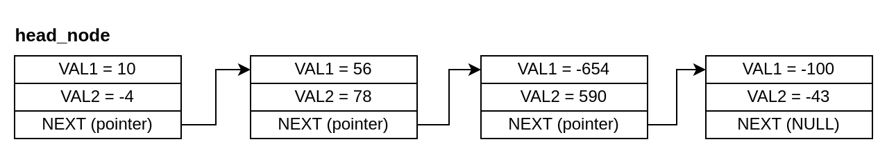

## Custom Search on a Linked List

### Instructions

In this activity, you must write a program in RISC-V assembly language that receives a number via STDIN, goes through a linked list and prints the index of the node where the sum of the two stored values is equal to the number read from STDIN. In case none of the nodes in the linked list fill this requirement, the number -1 must be printed.

<div style="text-align:center">



<span class="caption">Figure 6.6.1: Linked List</span>

</div>

For the linked list above, in case the input was 134, the number 1 (index of the second node on the list) should be printed as 56 + 78 = 134. If the input was a number that is not equal to the sum of any of the nodes (e.g. 8), -1 should be printed.

### Input

An ASCII encoded decimal number on the interval -10000 and 10000.

### Output

Index of the node where the sum of the two stored values is equal to the received value, if it exists on the linked list, -1 if it does not exist.

### Examples

Example of data.s file that will be linked to your program:

```riscvasm
.globl head_node

.data
head_node:
    .word 10
    .word -4
    .word node_1
.skip 10
node_1:
    .word 56
    .word 78
    .word node_2
.skip 5
node_3:
    .word -100
    .word -43
    .word 0
node_2:
    .word -654
    .word 590
    .word node_3
```

| Test Case | Input | Output |
| :-------- | :---: | :----: |
| 1         |   6   |   0    |
| 2         |  45   |   -1   |
| 3         |  -64  |   2    |

### Notes and Tips

- The head node of the linked list is stored on the address marked by the label head_node (DO NOT use this label on your code).
- The fields of the linked list node struct are VAL1, VAL2, and NEXT, in this order. VAL1 and VAL2 are 32-bit **signed** integer values stored on the node and NEXT is the pointer to the next node on the linked list. If there isn't a next node, it will be a NULL pointer.
- To check if the received value is on the current node, the comparison VAL1 + VAL2 = received value must be made.
- A NULL pointer is represented by the value 0.
- The indexing of the list nodes starts at 0 (i.e., the head_node has index 0).
- All nodes will have different sum values.
- You can test your code using the simulator's assistant from this <a href="https://riscv-programming.org/ale/#select_url_content=TjRJZ3RnaGdsZ2RnK2dCd2djd0tZZ0Z3aEFHaEJBWndLZ0lCY0laUzRDQmpBSnlnVk14Q2pBUUhzN1NBQ1lBVlFDU2NBQktvQU5nbFIwY1BBSUpFUzVTbkFESzlScVFDK1BBR1owT1lIZ0IwUUFPZ0QwWURnQk1BcnVOUUVMaFltUXFrekFLd0tuak1OazV1UGdBWkRob0ljUUFsVkNEdFBRTWpVMHRyZTBkbkdnNFlHRlFhVWlnczcxOFFBRzUtUUs1ZVlCNWlNQWNJVWk0NFRNb0RjVWM2SGgxOVF4TnpLMXNISnd0YStzYTZJdE15bUg4YWNWY2VBRkVBRHdBMk9GV2VWR1hTVkJnYkFubEZkeFYxQmlaZ2Z4NGVGckk2T3p5dUFBb0FTa3VZYSt1Q095azZWK25QanhTQUFMRWhtT3hRSGdBWGg0T1FBN2p3aEtJSkw4bnFZVnRJYUNSVUR4Vm1aVmhnZUFCaE94a1hxcVZBUU9nMFlFOExJOENBOEVLd0FEV3FCc1RLVXBoZTAyTXBIOGZPdWpsNGRGaWxXaHNOUUNMQ0VXaVl1NC15dW54QllKYU9UeUJSZ0JETUNGSndLZW9yaVBLVlF0UXZIRXJQWmNBdFpBbEt1MWFCeWRBYXFHdGxwc2JySWNCZ3RpY2lvK24yRlBCc0RRZ2NBQVJ1SU9PR0FjclFkcUlXWUlEWVBic3lHaUE0RFRFVERBZ29QTjhsbFREZ1RaOUNBQlBHQTBIaHdhRUFQajRwY0Joc3FabEY3Z1Z4c3pnT0RvWWpVZkRkdmpTWlRjR2QrME1jQkQ1Q2VGcGdiSTlOdElBRzBBQXdBWFM3UGJqWUpzcUYwRUFjVkYwK2IyRURBT0poRURoMEY0OXJNbVhZcCthdnY5Mit1OThUVWVRVDN2WkJzSEIyS1FBQkNkaTZMbzBnOGlZM2FBcCtVQm1OK3Y3RHYrMGgwS0I0R1FTVTBIdmtDdzdmbkFnR2tMcXBCdnUrOTc0YkF4RndDZTZTa2R1VUM2RWh1NzdvZTRqSHFlTURucWdMdzhLS3BCMkhRSHlrUGNxQ3h0dWZFQ1I4QjdpQVFvbE5wOFdpeU1BQjc1bkFsSjBPSTVhRXNKZGlvRm84bGJwOHBad1NPcVpPQ1I4bW1BQUt1WlBBQUl3OEU4QUNPdWxrSnFMekZ2SmY2Qkk0YWt1WkVVQ2tPV2NCcGhaTUZHU0FxekdBS3VEeWRjcGlydEZNeXhlRjF6VkkrU0NpdFJkaFZvV01DRWs4RUE0T0dQRlFnMkVCbU1KYkN2TkNNTGhwVkRCZ0RWK25oUjUzYUdSK3c2SnNtWm5wcFpJQTJiYUFCTWprdWVaN21lZUYzbnNMNXFEK1JhUVVoZVpHWTRhWUFBc0FDc1NXVGF0SUFBTFIyZHRLVTRlbHVaVXE2dWc1UnFXUUZVVkpYMWd5RFhWYVZkVlBVMVBFdGR1YldBaDF1Rmd0MW82aFN0UGJXYlpBRE1vMnVYbEhuSFQyMDBJTE44MkJjRlFOeFgwZTJyR3RSMGxxbGZSRGRqYU9uZXc1M1pibG1xM2NWcFhsVzlOVlFxOVZYdlYwQm1sbDJwYTZGd2psQnBDTUpyVmhrSUFEd3duWnE1OHdBMUtMUEh2TnVRYmpnQllCTGJhTUwzbzYwZ3VnckpGemd1bm9yblptNWlUdUNid1QxNnZBOXVBQUdnMjhBQUpNQVVCYUdiT000ZkRpTjJBRmkybzdqMXl5NU9vVnJ1dWpzNGJ4RkJ5K3J5NjZ3SEowWlNUbDFremRqbDNWVGowTTdUOU9OYThuMkI5OTc2LVJueGxkZkJKNmNlSVk1T0VlRXExbVZqYmhTMjNCdHZLSzZtS0ZKZmZHeHhUcmtPLTN3VTM3WkhnUSt1bXJ3eURPbnVFb2ktSkRHT1NaM2VsNjNmczhBQWhEQ3E2UzJqUWJ3S0ZoeEstbmxYbWMzdmNJWHN5QWdtajdPZExPWm84Tno5bDh6dy1Pd3VyZmVYK0xLK2V6d1EtSmppb3RiNTNPOWVqM3M5UUhYUDNCU2FOMzRqeGhFOE1CT0lBQlU5bGw0OEFzSTVkZTVrQ0FIVit0Y0RPelo2NTF6aU11VXdoZElod0NnYVlkdU1Jb0c4bkNrR1NNMFlKUTEwOENyWjB1d1M1eERvcDhDU2drZUJtd0FPTEQxUUlTRzJVQ3RCbUI0QUFFUTRIQ0dBVVprdzhITElCVG9vVmVMMXdTTDBCUWJobEM4RzJMa0lDbXBiNk1tQktLWFFVSWJad2xnQUJPRVpoK0JSQkNBK1VVTG9BRHk0WXZDNUZJSllrSVR4cUVsUjBHWXlSSEJreFFsTU5zZFllSTZHbURyRThPWVVBYUFzaDRNQ2FRM0YrWXVEckdZSktBQk5RQ053S0FNaGtod1lNNGlmSFNKQkRpYWNqSWFJNGhCQTBIZ041RGlhM1pFQ0hKc2lCSThBUUFZZCtSaCtaNklNVVk0QUppSnptTmNUWXlrdXdIRk9MeUs0cDR4VCt6UmhlRjR2SlVpYkQrSkFNVXN3eFF3bXhORkM4QkpFQWtsbTFMQm5GcVNvQ0RBakFyb1J3aFU2RE9uTEc4YkNueFQ2Y3d2bGZLa0Z5RDR3Q1ByU1BhMTlMNDhBYkNMUytlMDlxUzJ1WUNXNHZBdkFTZ0FMSU5HQkdZRTVIQm5nUXBCRzJZT2hnYXF3S2VKQ1VXOWtYaFFYa3N1UjVFQnl6TGtBYklQRkJLdkRybElUd1hGNXo4WExqSmNTNmxCTEFGQU1CVjBGbDdDUGdrcXdrcUxRRkRyZ01MVmpVeGNTaHZTK2dJSzhLV2dZTDZOSElNWEgwZTVONS1XMUxMV0FKRmhhcmxrRU5WY3k5OVpyMTlIQUVsRW84SGhWTUxFNU1JcTl3WUNTbVlPRVhBT1RDeXRUYXVnSEk5cFkzOE5hMjFzSTlXSFJpaEhDS2NyWFIyVXRXNngxSElOcFJXRFI2Z0E3QUFEZ2RSNi0xY0I4WSt2Nmdtb2FRYVlEdXFkVHdER0cxWFVacERUd0RhQUJPUktFYXMwSnJCZ1RZMUlBSzNwc3pjNnRWY2FzMHVzcldXamtDYTgwN1UrRUEwc1Fadmp5d0FHNlJGMHJJUnd1Z3FCRHZFTHBIVkY5dGhLRmdNZ09BazdYS0d0V0xJT3lZTTFxeUF4bHU3TmRrMXBneDdkMlc1NTllQlgxNXA4dSswckNIK3NmbEFaK0VyQVFBU3JqaGZ0UzdoMlhrVllpLVlLcW5nSFMxVnE5ZEFIdFZvd25rOE45eTdMdzh3Mm04Tkcxd1dqNUJnTk90R21DRktWTkJJNFJ5YzYzSXZQZlZPcHdaaFlCekRzUEs4RGRoQjBmcXhjQTdEaUhGMlFlMUxxUTVaR0tQNGZRVHdNZEU2UDBkeVZjSFg5LTZBTkFZQTJ4dGUyd3FEK29sQUxPcE1yelZPR3pmWkhnQUIrVGhDYWJiM3JzdmJIZ2hJRXBUSGtnbWtsT285UlBETmlwMjJXZzYwRnB0aHh2RHVsOUp0cDREYkNEWEgzbFdjZzdaLU5IcWJZNUIyREp0elpzYzZsajB3eTdqeXlqbmdWT1lGaTV2MTJXVW9pLWkyUU5HRjNXYWNFZWpCQW9BekcyOXZMWXBUeFl1WE1mVGNMSXRwTWpnTDZHWVpBQTV4QXhNcEI2ZjFWcmlsSFI0QmkzTDNnT0N3RFJDQWJrTTdlREZJbFBDSGdOa2RpTENyTDZQNHBnZ0s2RDJyR2tBTHd6QjdHSzZnY0p2cGZwVUlITDFxVVBCZ0lEaWVNdVlwLXMrQkJTa0ZwLUFDQUVhUklhSnFDdzRSZGlrRDJuY1NrWUJUQmFHV3hmVXBhMkVRQURGVHpiWThYdDB3U3ppaS1WR0FXSm9DRzJnZEFRcjRtclVwcUpmZEtWRnMwa2tlQWVOalBzZ015cktCUERBTEFXUWtCbGd2eXdmeERoOEtvVXdyaFpDNzljc1VXT1Z4M0pySEh3TVYyU3hZMW5nZE9VZHBiNVhzVldUQ2dZSmR3LVItSGtyZURzeHloeWIrUEdmMFktVlR3TUd6M2VDVHRrS1k3WStzd1BDLTJMVkhneTk4dlhFVjhzQ1VCMWdIUHExNThTZHdYMGNrWDQ0QnVCUW5nRTZEaEJobkVUeGVkMFktZHFJalU3U09UcW83c3JZTWtjUkc1MXhLTDladW5oUzZkMGw3VWpnWGtnall5Ym1FWWY2T0V2Mk5zRkxJRHV4Y3hnTVJDVVpzYmFUdDgxMXVrUUZNOHdtejdiSlB5dzgrbG1pNG40aXNoQ0xFUlR5MVZIZldWaEJQK0xnRUFMUVR6SUV3S0FEZ1RCTlFFQjd4M3JJWGU0QWtBZ0hJVEFPbFVCNEU3MUFSZDQraVJUNUVyUGtmOCt4OEVBZ0NJNWZJN2g4d0ZIK1A5N08rWjk3NFA1dndReC1WLTctWCtQc0ZsLVQ4MzgzNm9lLWMrRitiLTRQZnM4a1pYUUVBNE0wV0pVUzRZSEF5dzkrdisxQTVBVVNpQXJXbEEwZ1NXTEFxNHl3a2E3MnlCeUJTK2VBS3ExRW9vVGtZNEZBYUFMQVEwRzBJQWlrSUFCQTVZdEFrUU1rUGV4QmU0QTZrU1RnVkJXZ1dnUUFB" target="_blank">link</a>.
