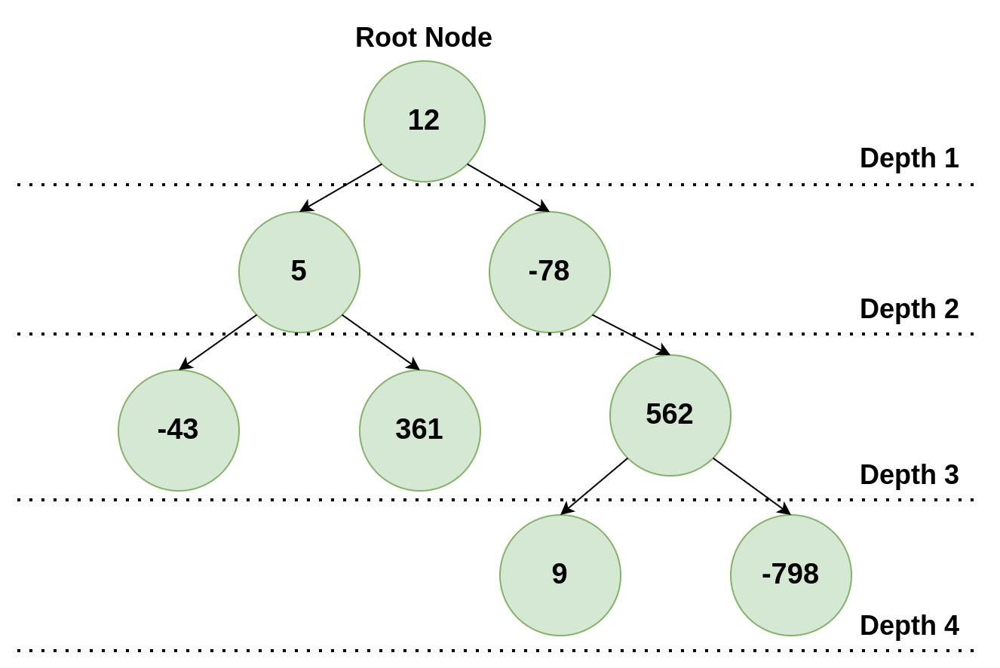

## ABI-compliant Recursive Binary Tree Search

### Instructions

In this activity, you must write a program in RISC-V assembly language that has a ABI-compliant recursive function **int recursive_tree_search(Node \*root, int val)**. Your code will be linked to a code in C that calls the **recursive_tree_search** function and expects the return value to be the depth of the value if the searched value is present on the tree, 0 if not.

<div style="text-align:center">



<span class="caption">Figure 6.8.1: Binary Tree</span>

</div>

The image above shows an example of a binary tree. If the value 361 was being searched, 3 would be the return value of the function, as it is the depth of the value in the tree.

Each tree node is a struct that contains a value on its first position, pointers to the left child and right child on the second and third positions, respectively. In case one of the children does not exist, the pointer will be NULL

**lib.h**:

```c
typedef struct Node {
    int val;
    struct Node *left, *right;
} Node;

int recursive_tree_search(Node *root_node, int val);
void puts ( const char *str );
char *gets ( char *str );
int atoi (const char *str);
char *itoa ( int value, char *str, int base );
void exit(int code);
```

### Input

Your function will receive the address of the root of the tree on register a0 and the value being searched on register a1.

Check the file [example.c](https://github.com/discovery-unicamp/ale-exercise-book/blob/main/reference_code/ch06-08/example.c) to see how your functions will be called.
The binary tree used in this example is the same as presented in Figure 6.8.1.

### Output

Your function must return on the register a0 the depth of the value if the searched value is present on the tree, 0 otherwise.

### Examples

| Test Case | Input | Output |
| :-------- | :---: | :----: |
| 1         |  12   |   1    |
| 2         |  562  |   3    |
| 3         |  -40  |   0    |

### Notes and Tips

- The root node has depth 1.
- The fields of the binary tree node struct are VAL, LEFT and RIGHT, in this order. VAL is a signed int value stored on the node and LEFT and RIGHT are pointers to the node's children. If a node doesn't have one of these - children, the respective pointer will be NULL.
- To check if the received value is on the current node, the comparison VAL = received value must be made.
- A NULL pointer is represented by the value 0.
- All nodes will have different values.
- The utility functions implemented in exercise [6.7](ch06-07-abi-linked-list.md) are necessary in this exercise.
- You can test your code using the simulator's assistant from this <a href="https://riscv-programming.org/ale/#select_url_content=TjRJZ3RnaGdsZ2RnK2dCd2djd0tZZ0Z3aEFHaEJBWndLZ0lCY0laUzRDQmpBSnlnVk14Q2pBUUhzN1NBQ1lBVlFDU2NBQktvQU5nbFIwY1BBSUpFUzVTbkFESzlScVFDK1BBR1owT1lIZ0IwUUFPZ0QwWURnQk1BcnVOUUVMaFltUXFrekFLd0tuak1OazV1UGdBWkRob0ljUUFsVkNEdFBRTWpVMHRyZTBkbkdnNFlHRlFhVWlnczcxOFFBRzUtUUs1ZVlCNWlNQWNJVWk0NFRNb0RjVWM2SGgxOVF4TnpLMXNISnd0YStzYTZJdE15bUg4YWNWY2VBRkVBRHdBMk9BQU9IbFJsMGxRWUd3SjVSWGNWZFFZbVlIOGVIaGF5T2pzOHJnQUtBRW9ybUJ1Ymdqc3BPamZwbDhlS1FBQllrTXgyS0E4QUM4UEJ5QUhjZUVKUkJJLXM5VEN0cERRU0tnZUtzekJzTVBJQUVLQ0FDMG1YWTRpZ0hoNE1Sb2Rqb3hBQWJyamliQUlIUUFKNDhBQXFkRlF1TlVxRTVOQkJwbGUwMk1wSDgwcHVqbDRBcmlNTGhxRVJZUWkwVmlsUUIxeStvUEJMUnllUUtNQUlaZ1FkZ0lJT2VTc3FrcjE4dFF2QUFSaHp1WEJTQUxjYkNEZWEwRGs2QTFVSEEzVEJPVnpQZDdkWjh2Z3JicllReTd4QndYYkpxUzdReW1YWUQ5V0R6WkN6QkFiRFpQVTVTT2pZMERUQUJoUXdJS0R6ZkpaVXc0UjFmUWhjbUEwSGh3R0VBUGo0N2FCZHU0WmdGN200TWFCUU15TmlUMlpWZnFMSmJnUVlPaGpnTmdhRUdlWVlqVWNGQUcwQUF3QVhRZFZabkdhenFhWCtaWHBZejA1bk4yWDg5MEVBY1ZGMGpmMkVEQUgwZUFnZUZvRjRaZEtRYlJ4bWtURjlYMlhRc1UyUVo1bHpJR3dPRHNVaGlUc1hSZEdrU1VUQ3ZJRUVLZ013a0pRaDgwT2tPaHNOdy1DU2tJMTgzd2ZKQzRBdzBoTFFyUzhtT0JGaU9HUU9CWUU0dUJmM1NPQ1p5Z1hRS1BCRDh2M0VIOC0zRFFEWGg0QVZTRVpUNHZUc1ZCYzFmTlNOTDBTSUNCMDRjdmkwV1JnRS1SczRCRk9oeEM1SWt0TlFMUlRPNHI1MnhJeDh5eklTdFgxTVhseXg0QUJHSGhuZ0FSMjBzaFRWZVZ0VE5Rd0pvTlFDTElpZ1VoSXoySHpUSnVVd2dvQUptTVdWY0N5dm9nb0ttWWlxSXI1cWtnemtRMTBPeHUyYkdBaVdlQ0FjQmRGVG9VSENBekM5TmczaGhXRVhWNmhnd0FHbHpLcGlxODNPWThGQzJMVXNNb3JVei1NQzNMUW9pOHRvdGl5cjRxcEVNa3JzRkswdTg1Ykt1eWtBQUZaVm55d3EyM092b0FHWXlwMm5qcXZyV3FSSWFrMHNoYXRxT29IWUNSdjZ6cWh1QnNhVkltMThwcUJHYmVMbTBpRnRPM3laMVdzZ2VFZWpiSXFhbUtLdmd5aUVvTzVMcVJPcGFVYjhrQXlRQUZoUEY2OGFZZ0FEV24tQVorNjNvVGRoUHZxeHJUVCs5ck91NjhHQnVoTUcrb2hycFhQYlM5WlN2WFF1RkMrTW9WaEttR0toQUFlV0VncFBWV0FHb2RaVWo1WDNqZGQwTEFVNzczQkFOcEdEWkg5dzlMMWozUFdRN2ZTNzBqeUNpOWRMekJHdkxKNHFHWUM5R0FCSmdDZ0xSV2VLdmFFRVM0blV2Uzh0eWFZazNOeVcwOHp6Wm5qVklvVTNUdmQ5UGlwdVlBYW9GTDZlZCswTC1vRm9HeGVGMFhScmVLSE01aHBpNGNianlIMExYOXczRU5jbkctRlUreTZvZEt0SFR4UjZQVXdsdDduNTVPS004TFlMVWlwNG5iOENDOXAxZUdRSU41eFZiWFRNazBMUE9YdnZaN1RuZ0FFSllSUEEzaXZqZUFscU9YME82WDh0cDlYc2o5bVFVRmlybHpwbmtWbFVRVlZZOERWbkNVNmE4ZUJRRDFqZkI2Tnd0N0ZseERySitQdGo0ejFJQVFJOFVBenpyek1zVmVCTzlZVFBId2JpQUFWTUZhK1BBTENoWHZ1V0FnWklncHd4dUkzRWMyb3h6ajFNRjNTSWNCaUdtSG5yQ1loVXBLcndsZ09oZUVGcGFxVUF0QndNZ0FCWkp3QkFVQ29HZUVYUXdnRktDT1dmcjFWK0s5WjZ5R0lVU1loc2d1NGtCQktkUnlEeG5LTUo0UEdaTWQ1WVNqek1GYklNZXhlNXhIRWpjZlNkQlBnTXdBT0xiMVFFU0VPeEN0Qm1CNEFBRVE0UENHQUtaaXc4QzVCaFRvUzFWS3NONEQwSXdDZzNES0Y0RHNYSW1GVFFnSWdEd0VFQXBkRFFoRHNJamNZaitCUkJDR1llZ0lvOWdBSGtYUmVGeUtRYXBJUTl6WmxlRG9VUjBTT0RGbWhLWUhZNndOampoU2FZZnN6dzVoUUJvQUFheUtkSVZBcncxWXVIN0dZTXFBQk5EQ3R3S0RBWEVBUURnUEEra3hKc0x4WEVTMVlESUFURHZVRURRZUNnU09OU0dBY3pVQm5NYUhFaEpQQUVBR0hnVVlOV2hUaW1vRktlVWtSa1N6QWRMcVFLWU16VFdsNUE2ZE14TXQ0T3E5TWlmMHdaazh0b3dHUUhVeVp6d1FSTEpXV3Nzd0ROMnlOd21qTFBVVGliWXUwUEVvOTQ3WjR5TkhJRDNHQWlaSDd3M05DYldBRll0WW5sa0xsRTgxOHZieGgyRW9LNWNCbVNSRWlpcWQydVZaQ1hWa0dTQUE3QnNKVlZOSHF5RWVxc0lLQ3FicXlBQUp4S3VWUWFqWTJER1hPaDRGSzhRMmtSV1dvZGtCWUFXZ3ZZV0NvUUFSV3h2azM4eXczazFDMG5rUmtxQVBKdTFNQVlEZ1ZBMlh6bDRTcUs0SUI1eE1IRkpnWUtzaFREV3RNRVNQS0thUUNPRjBES0pOcGdBQmtrYVF5bFZ3SDBCZ3lBUVI1cUpJVzR0Y0I4b2dHZGNHNDhwZzYybHI0VU9PTnNSdjVKdmxYME5OU2JGVjlCemRXdm9SYWtYUFRMYUdxQWxiUjIxcVJWVFV3VGFyd09vbmlBT3REYU8yeHZqVDJva2ZiVTJSSFRUd0ZWYXJoM0FyblNBQUFjdndFSUlSV3pscG5WV285ODc1eHdFdWt1cjJxN1cwVHVqYkNiZDNiRTFFazFmMnc5U2JxYkFkTUNPNTlWNmIxM3FuU0FDdFQ3ODB3ZHZSKzV0cUExMTFzWFNBTGRwZ2QyQVl4bG1nZFFHZFZacWc4aDY5cUg0T0lZdlpSdUR5N2lJaHZYVWk5OU9HWTE0WUEwZWlESUJpTThHdXZ1N041N29QanRmYXNlOTA3WjNDYnJjcXRESzZtTjFyRTJ4djlIR0UxSHFwa1IwRFJJalZudHpkQnVqNG1FT1B0bzdCMlRqR1czTWRmVEpwVG5iOE5xWTArSUk5S3JUVmthRXhSa3oxR2pONmZjd3h1TWxybzRRQm9LZ05ScEJaQUlEZ0YrWllzZ1JFN0R0YndDQVVyR3dRQmRDR1J3OFduQ3lwV2haa011VXlUa1l6dFdMTGNCSHE1ZGMtbDl5aFhpczBkZXFqUXJWTVN1NmZwZ1ZyRFpJcXVOZkt3cCtyZWF5c1hRNjYxN3JmUnBPZGVxMDFwRnlxV3VlWkFPMmMxTXhaYnkzLXBhcFdQQU5qQU5BY3lyaHhhSUZRUDFvYkdjNkZoNDhXdGRwQmU0NXM0OHVlUFFvVlFyWkI4cUZWWW5ROEl3U09GQ21LcUsyTEpYU3FjR1lXQWN3N0R6Z0lNOFE3eXllQUFCOWdlaFVCNE5ZOU5OWGdFVmRWRGs4a0NqaUZNMmxGTEkyeGxnQVdqa0d5cTBYbGpIZTVaUVo0LUxnSUpmbU1sdUFxWFdUbWtjTmkwRTlDckgrY0M4RmxVOFhvQms1U3lLS25tQ0RnN0dtNitWbmlYeWVVOCt3UWFPc3lsRzQrdXd6OExkZzhld2taMEYtWW5oUmNrM1JKVENVT0RWME16clNITU9ETmNNUFJVN3U0RWJzd3NSYlRtZU5kdG0yTTYyVGNWQTlEbWsyQS02eGRjak5hVU53WmR3K3lUYm1xT21SODJaakRadlpjVzZQTUg1WWVjTzBNeEV5R1hYNGNjRUMtWnhUem5uM0xUV21lTnJwRmNmT3NNeXNZbnBMSE8wdm1qVHphVFByN3M4MGR6emdsNytRM3VBK0wxYUcwZ1BXN3RrOFo4SThEclpBMTRsZlh2bkVzWnMzQ1Jzbk0yMjV5QW9XOUF5cThkOTJXQ1FDTHdXRVI0KzgzRi1xRk80dkJpMlFNMGhQLWJNNE51ejlTaGFSdkdlUTdGcENkYWxVSWRWM0ZyUEdZYTF6cVQrSmhDU09pLXdBcitKaHZ5Tystd0JULWppTXktdC04NE4rTkd6cVZlZmtWNHk2N1lhK055UUVwS1Y0QUF4TjlqYWp2SkJsQU1OSW1qTExPQ0NKeUR3QzZEaEhoSFFPN0VLdE51MkhBUitMQUxpSFJqd0xUQVBsOE15QndGQUdjdFFPUUZPSlBxK0R5bGFwRURncGVvbUR3Q0hMQ20wbVlLOGx5UDlnNnE4TjRQUVRBR3JtMkNBRDBqZ2ctbjl2dnA0RjRCSWM4QUFPUmxROFNxRTlLbVRuNndnTkQwRkVMT2otYTRGMFIwQXc0NEtjVC1hcFFESzJpNUpNaFFDc2gwclVDMlJpalBBRnBob1JxSml5RFdxdkRPeDRIU0RYYlh4V0ppb1ZqQ3BrcnRpd0ZBanhpajZGS3dnSWg4ZzdDa0NMRGRpSmotQ21DWVM2QmtnYkFTaG1EN0J6aEtMNUZ3dzJLTGh4RnFnOERFalpqUEJIZ3hIcHg4QnBSU0R1NFFBSUJpNFJCTlFXRGhCN0NrQmtqM0FpaGdCTHBGR1dxaVJBVHhFQUJpZjRWUnRpTG90Um1LcjJPS05BR3U3WW93VFlUUUxRWG9IQTdRMGdaRUF5cFlDSUlrNHhReGNNYmVPQjJZdVlGS3NZU016NHJCWHdVQitSS29rUitvWElVZ0g0ZnFEd2VRUEEzQk84TzJRSTdCMXFPQzl3and2QUh4cENJNnNnSkNOR1hzT2dRSlhzN1k3QkFvREk5aGpoRHF6aG9vTm9RSlBBWUpIQTRhY0F4YVVXbEFIQjRnY01kQkRCM3ltRVJ3endDWVpvdkFZbzJCSkM5d1BBY00xSm5RSkNhQTZDb1V0d1dCVEpkSmNNN0IraFVJaUtsSjdKTko5d0RKSEo2SjFoaFM1SlB4SDJzZ2pKNko5d3VKcm9oQXVJaEo5Qlp5SVJ6dzdCaFJYczl4MlVVK2xxTVJLbzhSQVV1d3lSK1JhUklBR1JXUk9SZVJzRVdwRnFyb0pScW9pSUZScVlWUk5SRms5UkFTZlFUUkxSRFFwbzdSZVF6bzNSRHNBRS1Sc1dlZ2Y0aHBaUll4amdFeDJZMHgyYXFCWmdpYWNNU3graGRBTUVyUTZ4SFFXeHhZMkphb2V4c1pCeFhzUnhreHB4R0JXY0J3WjJZQXNBc2drQXl3TUNMQzZrWGlQQU1pRFFJSVpndWdLWUx3YlpvSUoyRzQ0c1pDenc5Wng2UEFOWm53dHVEQ0trdHU0NTVaTkIxS0xpWk1uZTZPNHFkZUgyQkFqWnZtcVNHRUJ3K09wMmhPeE9qMEF4dkExcXNnK0dYc0I4endjc0RVWnlJc1ZCVnhRSStHdThPQ2UyWHhNNHVobkstWk5nWjJGMmwyZ1JsMmQyRHlqMnVJenczZWE1TnFuMmlCdjJUZ0FPa1E1aFpLMndCeXVJYjVHOG0rODRjdW41Qk92S3NnLUJlUWdocUF3aDQrZ29ZaE5PWDhJSW81RENPQ0g1V3VPdW9jUE95dzRjTit2eHBrVDV2b2JzWmVzZWRGNkZqRlpnNTU0UmVwdkFRa21FZHhJY2QrWlVETTRaN0VuRUlsd0ErR0xrTE1KWnpvQmszT25Fc2dVbG1FZmVFMFp4OFJLd295TVl1QUlBTFF2NHlBbUFvQUhBVEFwb0JBcGxobFdReGxna0NpY2dtQVRrZUFSbE02OWxFQU5ZVGxGaUxsdGxibEpBRUFZU1hsMmtQbE1BZGwtbEl4UVZxQUlWWVZDaWdna1YwVmZsQ2lNaThWTmxvVmlWRUFxZ0tWcmxBay1sLUFLVi00eVlJWWh5elFCSzh5TG9IQXl3S1Z4VjdnOHlpQUVoZXdHWmdPTEFKNHl3eXFJeDdWN1ZubGVBUEtJa0FvWVVhNEZBYUFMQXVVbDBqYWVBQkF3aG1vQnlwbDVrWGF6STR1VmxHQVRxV2dXZ1FBQQ==" target="_blank">link</a>.
