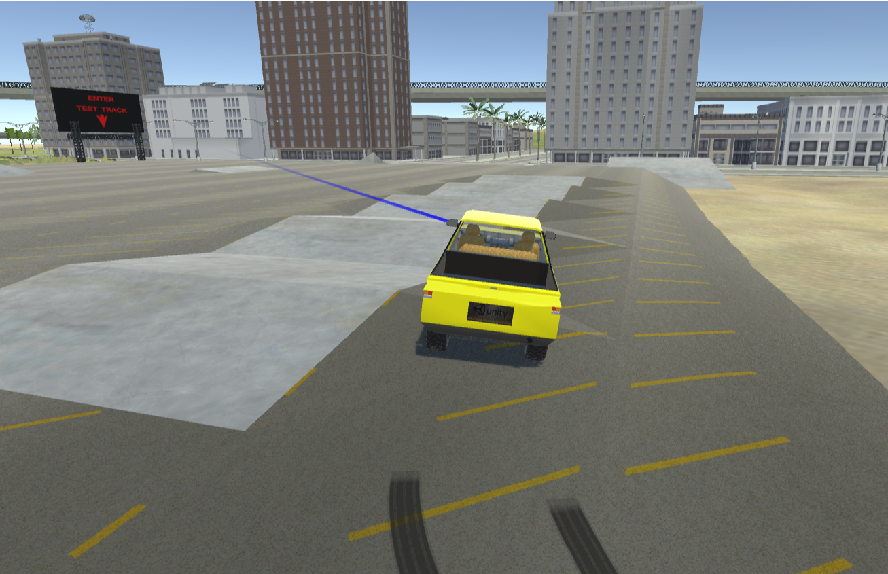
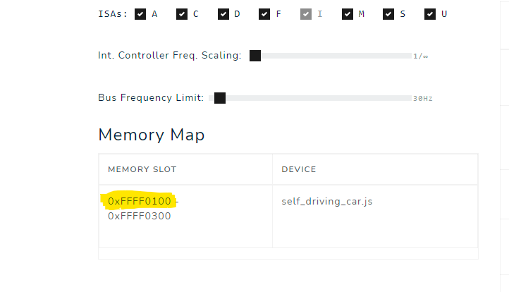
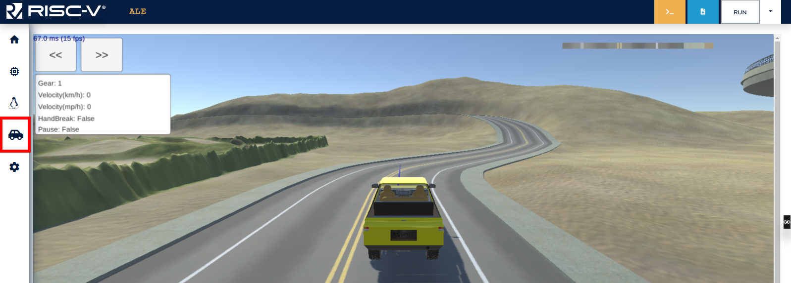
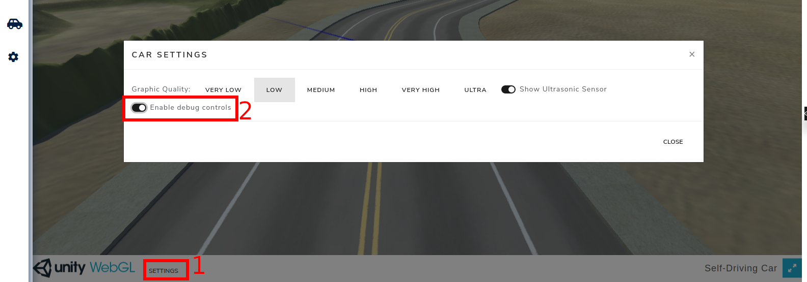

## Accessing Peripherals - Controlling the Car

### Instructions

In this activity, you must control a car to move it from a parking lot to the entrance of the Test Track (shown in the picture below) in, at most, 180 seconds. The car is an external device connected to the RISC-V processor and can be controlled by syscalls or MMIO.

Figure 7.1.1: Car Simulation

- In this exercise, you must use only MMIO to control the car. The MMIO specifications for the peripherals of the simulator can be seen [in this document](https://docs.google.com/document/d/1AE_ESrJnxzMO_WpN2yoZTyB5fGPl8wrpAzT7bij1QJk/edit?usp=sharing).
  - You only need to use MMIO to control the steering wheel, engine, brakes and get coordinates.
  - The entrance to the Test Track is placed at:
    - x: 73, y: 1, z: -19
  - The base address is shown at the table "Memory Map" (see example below)
- The car will be considered to have reached its destination when it reaches a point inside a radius of 15 meters from the Test Track entrance. Your code must call the exit syscall to finalize the execution.

### Infrastructure

In order to use the car, first you must enable the device 'Self-Driving Car' on the RISC-V simulator. This can be done on the tab 'Hardware' and selecting the device ‘Self-Driving Car’ as shown in the picture below.

After adding the device, its base address will be listed on the table:

Figure 7.1.2: Memory Map Table

The car can be accessed through 'Self-driving car', on the left bar, as shown in the picture below. The car icon can take a while to appear for the first time.

Figure 7.1.3: Car Menu Tab

Note that, after adding the device, the car will be placed in an arbitrary position. **Use the Assistant** to place the car inside the parking lot.

In addition to that, you can test moving the car manually using the arrow keys or WASD. To do so, enable the option ‘Enable debug controls’ on the simulator, as demonstrated below.

Figure 7.1.4: Debug Controls

### Notes and Tips

- Check the [ALE Peripheral MMIO Manual](https://docs.google.com/document/d/1AE_ESrJnxzMO_WpN2yoZTyB5fGPl8wrpAzT7bij1QJk/edit?usp=sharing) for information about the Self Driving Car peripheral.
- The starting point and destination are **fixed**. <mark style="background:transparent;color:red">You have to use the assistant to place the car at the starting point (there is a button on the assistant that can be used for that)</mark>.
- The steering wheel direction values range from -127 to 127, negative values steer to the left and positive values to the right.
- For debugging purposes, you can control the car when the rest fails, using the keys WASD or arrow keys, with the option ‘‘Enable debug controls’’ enabled. However, this option can't be enabled while your code is running on the simulator.
- You can test your code using the simulator's assistant from this <a href="https://riscv-programming.org/ale/#select_url_content=TjRJZ3RnaGdsZ2RnK2dCd2djd0tZZ0Z3aEFHaEJBWndLZ0lCY0laUzRDQmpBSnlnVk14Q2pBUUhzN1NBQ1lBVlFDU2NBQktvQU5nbFIwY1BBSUpFUzVTbkFESzlScVFDK1BBR1owT1lIZ0IwUUFPZ0QwWURnQk1BcnVOUUVMaFltUXFrekFLd0tuak1OazV1UGdBWkRob0ljUUFsVkNEdFBRTWpVMHRyZTBkbkdnNFlHRlFhVWlnczcxOFFBRzUtUUs1ZUNMb0V3eE56QzFRQUQxSlVHR0lzNXh0VUFEY29HaWNMQWdsZE9Cc0dQcGhrT0dxaXZ4aC1HbkZYSGdCUkpvQjJPQUJHSG1iV21Cc0NlVVYzRlhVR0ptQi1IaDVNOXRJNk96eXVBQW9BU211WVc5dUNPeWs2Qjh5dDhmcVFBQllrTXgyS0E4QUM4UEJ5QUhjZUVKUkJJQWE4QUFZQUhqQkFCWUFIenJhUTBFaW9IZ2JNemJERHlHZ0RSUlRIZ0FCV2tqREIwa2l4d0F0RHdBTUpaUjRjY1RpV0RJSGpnOG04aUIwYkVXZkVFN0VBSXpvQkp1UHlWZGxJcEN5NG9BbmxKWWFaRlpydFFzUUR3b0RaRFNCcW5CWUZCRUJ4aW5kbGtScllyU044UFRBdVFnR0pBNkxyVEFUVktncXRMeFJ3TFFGOHBFZUp4aVBrc3JMalZxc3FxUWJjTldudnFSOWFoM1Nhc3FZTFZiVFA4YkJCV2pOcFk3blV0WE83UFR4dmI3LWRLZ3lBQ1FCeE1OM0NNME94ME9odFhnSnFCSm1BcG9zd0RNLUhoS2xWcTI0aFFqaG1yanljMDdFRUpEZlMzVzIyRDRlanV2QjJXN2lnRXpIdllITG5nMmNKMk1DanN4b1VpclJ3dnlnQUlWMWdoc1Y1eXdRU3RxMXRCTlRIZU13c2lXZm9BR3M0UjRPQTRRSlBoWmpzR05kUUFXVnNCeFVETVVORGl3cHdDQlFWQWdKdGFWVEZrVXgzMVVjaFNEc1lwYnkwZTlIMEhiOVBIZlQ5VUU0djhBSW8yMTdUUEVBb0pna1VhQVErRmtOaFZEZ0ZtWVlxSGNWcFhtQUpvYVcyQUFPQUFHTXdBRlpaRjFHa0FDWXpBQU5sa0FBdkdrdVcyYlROTE1iU3RGa05TYVYwN1lOa01teUFHWTlMTXN4TktzdHpISzBGai1IQ3pNZUVVd1JLR2tIcElsZUQ0VUw0ZTliaWdYUlhsbVRjQ25nY1FPR1FNeEhDbWNFZUZRN1RQbFNuNTJPZlY5dUstVWQrTUEwd2p5SEVjVkFnMFN6RmdISTZCRUFBVkxDUWtRZ0FwVlFBSGtBRGt6RElCZ3BuUzNWTXVsTXhzcXlPQTh1UUFCdExLblFuSEsxdnl3cTJtUUVxZVcyQUJkVzlLdFl5TG5KNFBUdFBLdTlJc2NYZ2VqRExoRUkyczdnWG5GNmVCSE9KRUtSSGd3Z2lhSllrcUlGNzNCU0Y3aHlQSWNvSVphbUxCVjRBY3FTN0lwaHBHLVZRYnBkRmdQRzRHbFpCam5oRGJUQzVMa2tSRlJWcVBxS25GSkhaQjZkTVhkWVcwellBREVlWjUzbFdaQUttU0FnQVdJQm9Hd0NiQVA1VEcrNkdJU1I2RXpBZ0d3YkRnVm95Q0F5TGJsTWZsMkNnWlpKMm95cVpMa3lyYm5SN2d6QkhkeHVDaHJXZmhIUmk2RnplVzN6YVZrYUJtUXdFSDExQTFhY1VnUGp0K2RiaDBHajdlQVBSb0hFT0JVR2xjUWpQRko1eVd1K2RNZm5iR29TZ0pXVmY5alhUQ1phVTRORkVHT0Y0YlVlRDZnT1M3NnVneGJnK25DRjFHQWFEMERDRVoxSkt2aEQtczZHbXNOcUFZOGpYSjRMVGRJTW5oRTlNaXllR3NuaGJQc2tLWFBVbmgzTTh5ZWZMOGdLZ3RYa0wwNUQ3YkV6MjliUHRsKzIzdTFHcHliUG52MHRlQUJDVjRJRVJhQnk5ZHA1NEdJTUFIQ3JONTNuLTd1UGR4U3UwVnV0Q2lFMG93RTBjRkZDUXVSV2cyRWdqOUlCbWN3R21BZ1hvWDJNREhCNUR4b2dzMi0wd3hEbStMb1RrcUFrSHptdXBWZTRCQWhUNFZRU0FBQVZFdzVoTENvajhBbWhOUVFFMXV3c040Y3d2QkN4N2JVUExpVFBzOElSNGJHOG1ZUEVlbHZKZVZIbVlieUd3ekthUzBqdld5QUJPTXdHd05IYVQwbmlWT0lkZEFmVmVIOVhnOEp0SWxIRkF1SGcza3pLV1BGQUFha2NlOEZLOXRiam9Vd2poTkkrRkNJMkdJa1FNaWdrcUs0SHFIUkJpVEVCRkFKNE0tVit3RElRRUVjTEVWNDkxSHI0T29iUXdxK1VLSjhKWVpOVllsZEJCWVZXS29QcXF3bVM1TjRjWWNLb2x5RWh6dm9mWGFxMTFxSFdLbUNVcXE4S3J1SitCZkQ2OEk1RERnZ0xxTXcraERDTFQ3aXRYSytWM2o0TU1iZlhRUEJYaTlMN2tWWTY3U3lxdU1BZEU0UjhZblNJV1dSdFpaclMxbnoxSGpmYUpkeE9pOEJzRW9SQ1dFcXhnbW1nQVIxdHE4Y2dkQjN4bUNhS2NoTVh6M2hNT01qd1J4aXozbWZOMUQ4cDBaaGRULUlZWUM0RmJ6UkdlRXNoQ3BHbGtZWEdSbWQwanhuUk1sZ014SlV2a0VaSmt4UExyQ0FBSk1BYlFOSlhnVXQrVTBXNnRMSVc2Z1pjQVg1bGxRcG1CNEFBRVNVQlFBWXRRakNncjdGV1JaRktoV2VIcGJJTVZpS29Vc3ZGV1lkbDd3YVFVcHVXUVZpLWdieDFQbWE4VlZ2QnNUd20ySHBMcEZ6UVN1ekFiTVRJd29TREgybVZxNUJacnNtTk1uUHRaQSs4VFdaeklCd0JBMUEyQS0wdnNIRTFCQ25hNW1UbmFpaHN5cnBVSnhZNExKeUFja3NNcm13VkFIQk5ROEJpR0xka05nZUNWS2lTSEZCanFscVdwRkIwS1pycTdYNXJqVTZtMVpiS29ldTFONnIrZnEtNTJzZGtRcU80aGhoMUswR1lSVXNCQUxZMy1rOURPSURzNEV4Z0pFT0Exc0hEbUtRaWhMWkRzSWFXd3RxUUNtSUIxWlVDbmVJVWd4UXpxSVV6b3JkZGs2bkRUb0lIYXUrOTk5M1owUFp1N2RHMXRJWFNEVzJ2d3BSS3AtV1FIWGJvaUZMR1ZXTVRVVXhmWVlRR3FzVENiRThTRlpYb0RrZXY0VzZrYXJQQk1CNXhtejhIdnVWdVNSeDhKTDFtR3ZjZW1ERzBvQm5RWVhaTzFjeUYxeEN0b3VsZHBneDBUcFE5MEdXaUZhTmtOZlgyUlVlVkZTSVdYVzdIcVZZLWJMb0RmT1Z0enNlQ1ltN0IrMUF5cmdDTWU3ZHlqZ2lJWUI1V1ZwUEZOTlIxMEVNQnFNb3dDZzNES0Y0TTBYSW1vY29MZ2dEd01FSTVkRGt1QUlpUHRzbXpEOENpQ0VNdzlBNDZ0REdvcUx3Y0M3TWhGZUt4amdpcDNnNkVmSEpoVFpZUUROQzJOc2NqY1JneVpRa2doZGtJNTNpeWdnQVNNd21KN3lHT3VwUXdSd04xamhidHJnRzBXUUNiSUV3S0FMMWs0Q0NsY0t6QVlyZHBTSnlFd0k4T3dxQThEM0ZxOExYa2pYazZ0YUsxQWFZd3N1VmRlYXoxbXJmVzZzUUM1a05scjFYMnVrVUVGTmticzJJQllRV3pOc2J3dFZDcmJhK3QwaS1CVnR0QWdLeHYyTkNaanNra29xRGdUUlZzbmZjSkpSMHNCV2gwRGdQRmNReldXQ2N3Mkx6UG1CV0h0d0gwS2dKNWs2S0JvQllNWlBTSUJuSWdBSUxxV2drUU8ybGNoOTBQbzlJcXZESEVLTWNZVUJKalRGbUQ0VkhlVm1BWURCMlpMUXBPdEJBQQ==" target="_blank">link</a>.
